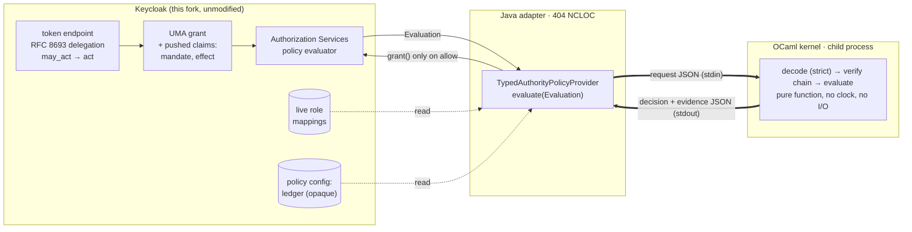

# OCaml does Keycloak


This directory asks an unreasonable question: **can a small OCaml program
reconstruct and verify part of Keycloak's authority model?**

It asks it twice:

1. **At runtime.** Through a custom policy provider, Keycloak's
   Authorization Services can hand a decision about "may X do Y to Z" to a
   ~1,400-line OCaml kernel. It gets every decision covered by a permission
   that uses that policy. The kernel does not ask *does the principal hold
   the permission?* It asks five questions and returns the answers as data:

   | question | kernel's name for it |
   |---|---|
   | Who is acting, and on whose behalf? | principal |
   | Under what mandate? | mandate |
   | Which capability are they invoking? | capability |
   | What effect are they trying to cause? | effect |
   | Where did that authority come from? | provenance |

2. **At the type level.** `attempt_proof` reads Keycloak's Java
   authorization types and searches for an OCaml type graph that carries
   the same facts. It reports, obligation by obligation, what OCaml can
   prove, what it can make stricter, what it cannot know, and what it must
   refuse.

Java says: *this is how authorization works.* OCaml replies: *prove it.*

Keycloak is not rewritten, and none of its code is modified. Outside this
directory there are only three changes:

- a pointer at the top of the root `README.md`
- one CI workflow in which Keycloak files its authorization types with OCaml
  (see "Keycloak files paperwork" below)
- one extra entry in the exclusion list of Keycloak's own
  `.github/scripts/find-modules-with-unit-tests.sh`, so that Keycloak's CI
  does not mistake the standalone adapter for a module of its Maven build

Everything else lives here, as a provider jar, a child process, and a pile of
evidence. `./verify-all.sh` checks that no other file differs from `6688a3d6`.

> The hypotheses were committed before any kernel, adapter or solver code
> ([`docs/hypothesis.md`](docs/hypothesis.md), commit `c7106ebe`). That commit
> also added the strict JSON codec `lib/json`. The hypotheses file is
> unchanged since. [`docs/experiment.md`](docs/experiment.md) scores the
> results against it one by one, including the ones that went against us.

---

## The problem, in one token

This is a real delegated token from the demo. Samantha logged in, consented
to let `research-agent` act for her, and the agent performed an RFC 8693
token exchange. The claims are captured in
[`examples/keycloak/demo-output/delegated-token-claims.json`](examples/keycloak/demo-output/delegated-token-claims.json):

```json
{
  "sub": "<samantha>",
  "azp": "research-agent",
  "act": { "sub": "<research-agent service account>", "client_id": "research-agent" },
  "realm_roles": [ "document-publisher", "realm-operator", "report-author" ]
}
```

The agent was delegated to *help generate a quarterly report*. Its token
carries every realm role Samantha has. A conventional role policy
(`hasPermission(token, "publish")`) therefore grants the agent the `publish`
scope on the report and the `administer` scope on the realm-configuration
resource. The live demo shows exactly that, on this fork:

| scenario (live, Keycloak 999.0.0-SNAPSHOT @ `6688a3d6`) | role policy, token roles | role policy, live roles | OCaml kernel |
|---|---|---|---|
| 01 agent reads q3-report for itself | allow | allow | **allow** |
| 02 agent generates the report for Samantha (`produce → organization`) | allow | allow | **allow** |
| 04 same, but `produce → public` | allow | allow | **deny**: effect exceeds mandate and grant |
| 05 agent reads for Samantha after that delegation expired | allow | allow | **deny**: `expired` |
| 07 agent *publishes* under mandate `generate-report` | allow | allow | **deny**: mandate does not cover `document:publish` |
| 14 agent administers the realm "for" Samantha | allow | allow | **deny** |
| 09 Samantha loses `report-author`; the agent reuses the same token | **allow** (stale) | deny | **deny**: `anchor_missing` |
| 06 agent publishes via a grant with no provenance | deny | deny | **indeterminate**: `insufficient_evidence` |

The full table has 12 rows and comes from a real run. It is in
[`examples/keycloak/demo-output/results.md`](examples/keycloak/demo-output/results.md).
Within role policies the comparison is fair:

- Keycloak's role policies were given every role the kernel's ledger
  anchors on.
- The second RBAC column uses `fetchRoles=true`, so it sees live role
  mappings rather than token claims.

Keycloak's other native policy types were not tried: client, client-scope,
time, regex, aggregate and JavaScript. A regex policy, for example, can
match on the `act` claim.

## What a decision looks like

The kernel's answer is a typed value with evidence. The same decision exists
as JSON (what the adapter logs) and as text. Scenario 07, from the fixture:

```
DENY
principal:  research-agent (service) acting for samantha (user)
mandate:    generate-report
capability: document:publish on q3-report
effect:     disclose -> public
reason:
  mandate generate-report covers document:read, document:generate - not document:publish
  mandate generate-report bounds effects to observe, produce:organization - not disclose:public
  g-samantha-publish: holder samantha (user) is not the acting principal research-agent (service)
  g-samantha-publish: ledger path [samantha] differs from token path [samantha > research-agent]
  g-samantha-publish: usable only under publish-release - not generate-report
  u-agent-publish: ledger path [research-agent] differs from token path [samantha > research-agent]
  u-agent-publish: usable only under publish-release - not generate-report
candidates:
  g-samantha-publish     refuted       holder_is_actor fail, delegation_path_matches fail, mandate_permitted fail, mandate_covers_capability fail, effect_within_mandate fail
  u-agent-publish        refuted       delegation_path_matches fail, mandate_permitted fail, mandate_covers_capability fail, effect_within_mandate fail, provenance unknown
```

And an ALLOW, scenario 02. An ALLOW always carries the chain that justifies
it, back to a role Keycloak holds **right now** for the chain's root holder,
here Samantha:

```
ALLOW
principal:  research-agent (service) acting for samantha (user)
mandate:    generate-report
capability: document:generate on q3-report
effect:     produce -> organization
authority:
  g-samantha-generate    samantha (user)            root: realm role report-author
  d-agent-generate       research-agent (service)   delegated by samantha (user) from g-samantha-generate
  anchor: samantha holds realm role report-author (facts.source = fixture)
checks:     all 8 passed
candidates:
  g-samantha-generate    refuted       holder_is_actor fail, delegation_path_matches fail
  d-agent-generate       authorizes
```

In the live run the anchor line reads `facts.source = keycloak`: the role
mapping was read from Keycloak's model at decision time, not from the token.

## Architecture



- **Keycloak keeps:**
  - authentication, token signing and expiry
  - delegation consent, and the `act` chain it verifies
  - the resource/scope registry
  - policy composition and enforcement
  - role mappings
- **The kernel decides** whether this acting principal, under this mandate,
  may invoke this capability for this effect, given the grants in a ledger.
  Each grant carries its own provenance.
- **The Java adapter makes no grant decision.** It projects state, runs the
  kernel, and calls `grant()` only on a well-formed `allow`. The one thing it
  does decide is whether to believe an `act` claim (see below), and there it
  fails closed. It also fails closed on everything else, including crash,
  timeout and garbage output.

Why this seam, and which alternatives were rejected:
[`docs/architecture.md`](docs/architecture.md).

## The model, for an OAuth engineer who has never written OCaml

OCaml is a statically typed functional language. The two features that matter
here:

- **Variants.** A variant is a type whose values are one of several named
  shapes, and the compiler forces you to handle every shape. Effects are one:

  ```ocaml
  type audience = Self | Organization | Public
  type effect = Observe | Produce of audience | Disclose of audience | Administer
  ```

  "Disclose, but to whom?" cannot be left unanswered, and "observe to the
  public" cannot be written.
- **Abstract types.** A module can export a type while hiding how values of
  it are built. The kernel's `Authority.t`, the proof that justifies an
  ALLOW, is built only inside a private module. `Decision.Allow` cannot be
  constructed without one, anywhere outside the kernel library.
  [`test/authority/must-not-compile/`](test/authority/must-not-compile) holds
  code that tries, and the build checks that the compiler rejects each
  attempt for the stated reason.

The rest of the model, briefly (normative: [`docs/authority-model.md`](docs/authority-model.md)):

- **Grants** say who may invoke which capability, under which mandates, up
  to which effect. A grant without provenance does not type-check. A ledger
  entry that arrives without provenance decodes to a *different* type, which
  the chain verifier cannot accept.
- **Provenance** is either a *root*, anchored in a Keycloak role the holder
  must hold *now*, or *delegated* from a parent grant. Each delegation link
  is checked for attenuation: no wider capability, target, mandate, effect
  or validity, and no extra depth.
- **The confused-deputy rule.** The delegation path in the ledger must equal
  the `act` chain Keycloak verified. An agent cannot use its own authority
  while acting for Samantha. It also cannot use authority Samantha delegated
  without a token showing it is acting for her now.
- **Effects are ordered generically**: kind × audience reach. There are no
  scenario-specific rules.

## Run it

Requirements:

- OCaml ≥ 4.14 and dune ≥ 3.0 (`apt install ocaml ocaml-dune`; no opam packages needed)
- JDK 17+ and Maven, for the adapter and the extractor
- `curl` and `jq`, for the live demo

```sh
cd ocaml-authority

# 1. Everything OCaml: kernel unit tests (135), adversarial tests (527) and boundary tests (25),
#    13 demo + 43 adversarial scenarios, captured outputs, 11 must-not-compile checks,
#    and the proof search's suites, including its adversarial ones.
dune build && dune test

# 2. Ask the kernel directly.
_build/default/bin/authority_kernel/main.exe eval --text examples/requests/04-wrong-effect.json
_build/default/bin/authority_kernel/main.exe scenarios examples/scenarios/demo.json --check
_build/default/bin/authority_kernel/main.exe compare  examples/scenarios/demo.json   # RBAC vs kernel audit trails
_build/default/bin/authority_kernel/main.exe ablate   examples/scenarios/demo.json   # which dimension decided each case

# 3. attempt_proof: re-extract Keycloak's Java authorization types (the working tree is read;
#    --commit only labels the output) and check they equal the committed graph, then search and check.
java tools/java-graph/JavaGraph.java --root .. --commit 6688a3d63f59e0c4a9131bfdd556c4312799f04e \
     --slice tools/java-graph/authz-slice.txt --out /tmp/graph.json
cmp /tmp/graph.json examples/proof/keycloak-authz.graph.json
_build/default/bin/prove/main.exe examples/proof/keycloak-authz.graph.json --report
_build/default/bin/prove/main.exe --check examples/proof/keycloak-authz.graph.json examples/proof/certificate.json

# 4. Build this Keycloak fork (installs the 999.0.0-SNAPSHOT SPI the adapter compiles against,
#    and the server distribution the live demo runs).
(cd .. && ./mvnw -pl quarkus/deployment,quarkus/dist -am -DskipTests install)

# 5. The adapter, with a real kernel round trip. Without step 4, add -Dkeycloak.version=26.7.4.
(cd keycloak-adapter && mvn -q test -Dtyped.authority.kernel="$PWD/../_build/default/bin/authority_kernel/main.exe")

# 6. Live, end to end, against this fork.
examples/keycloak/run-demo.sh

# 7. OCaml's review of this checkout, and of a change you have not made yet.
./prove-it.sh
./prove-it.sh --what-if examples/proof/what-if/typed-act-claim.patch

# Or all of the above, recorded to docs/verification.md:
./verify-all.sh --live
```

The versions, commands and results of the recorded run are in
[`docs/verification.md`](docs/verification.md).

## `attempt_proof`: what OCaml says about Keycloak's types

Samantha's original sketch:

```ocaml
let rec attempt_proof (java_source_graph, ocaml_source_graph) -> (ocaml_source_graph, boolean) =
  (* Attempt to converge the ocaml typing system to parity of the java source graph, or backtrack *)
```

What it became ([`docs/proof-search.md`](docs/proof-search.md)):

1. Extract a source graph from 19 files of Keycloak Authorization Services.
2. Derive 760 obligations from it (nullability, set uniqueness, commands,
   bounds, dynamic values).
3. Condense the graph into strongly connected components.
4. Search encodings with a memoized, backtracking, branch-and-bound DP over
   *(component, residual demands)*.
5. An independent checker re-derives every verdict without searching.

On the real slice:

| verdict | count | meaning |
|---|---:|---|
| PROVEN | 721 | OCaml carries exactly what Java declares |
| STRENGTHENED | 7 | Java returns `null` at runtime; OCaml makes it `option` |
| UNKNOWN | 29 | depends on facts not in the graph: `Object`, `Map<String,Object>`, external types, implementation-defined `equals` |
| REFUTED | 3 | no encoding carries it without weakening; the counterexample names the conflict |

The refutations are the interesting part. `Policy.getAssociatedPolicies()`
returns `Set<Policy>`. A set needs an ordering, and an ordering needs a
comparable value. But `Policy` is not data: it has 8 mutating commands
(`addScope`, `putConfig`, …), and OCaml can only carry behaviour as
closures, which cannot be compared. Java's `Set` works because `equals` is
whatever the JPA adapter says it is at runtime. The emitted type
([`examples/proof/keycloak_authz_types.ml`](examples/proof/keycloak_authz_types.ml))
records this on the field:

```ocaml
get_associated_policies : unit -> policy list option;
  (* ... REFUTED Unique: Policy must be comparable because
     Policy.getAssociatedPolicies() : Set<Policy>, but as Record:
     Policy.removeConfig(String) needs a closure; ... *)
```

On the real slice the search is shallow. Every strongly connected component
is a single type, and the DP beats greedy per-type choice by one refuted
obligation (3 vs 4). The DP's optimality is tested on 250 random graphs,
where it equals brute force.

**And then the flashlight mostly failed, which is the result we care about
most.** Before building anything, we predicted (P3) that the obligations
`attempt_proof` cannot discharge would point at the places where the Java
adapter needs hand-written glue. We measured this against the 44 glue sites
the adapter listed at `a62035c9` ([`docs/flashlight.md`](docs/flashlight.md)).
There are 47 today; with them P3 is 1/47 = 2.1%.

- **P3 is 2.3%**, against a pre-registered 75%. One glue site corresponds to
  a non-PROVEN obligation.
- More than half the glue lies outside the slice, where the search has no
  opinion at all.
- **Of the glue inside the slice, 95% is PROVEN.**
- **All 13 sites that carry the delegation chain, the mandate or the effect
  are PROVEN.** `act` arrives as a JSON string inside `Attributes`. The
  pushed claims arrive through a `Map<String, List<String>>` built by an
  unchecked cast, which lies at runtime. The live demo captures a scalar
  claim making Keycloak fail the request with `ClassCastException` before
  any policy runs.

Authority semantics hide inside well-typed strings, and a type-level proof
search is structurally blind to them.

We predicted the mechanism in writing beforehand: the delegation chain,
mandate and effect would all be PROVEN, and they were, 13 of 13. We also
predicted that Q2 ("false comfort" above 50% of glue sites) would be at least
partly triggered. On the pre-registered all-sites reading it was not: 43.2%.
It fell short only because most glue lies outside the slice.

## Keycloak files paperwork

The CI workflow `.github/workflows/ocaml-does-keycloak.yml` makes the joke
literal. Whenever Keycloak's authorization types change, [`prove-it.sh`](prove-it.sh)
re-extracts them, OCaml re-proves them, and the independent checker verifies
the new certificate. OCaml's review lands in the job summary. A change that
gains a REFUTED obligation fails the check.

On this checkout:

> **No drift.** The slice is byte-identical to the one the certificate was
> issued for. Verdict: **accepted.** Keycloak may proceed.

`--what-if PATCH` asks OCaml before you make the change. It applies the
patch to a scratch copy of the slice, never to the tree. Three hypothetical
Keycloak changes, with OCaml's reviews committed in
[`examples/proof/what-if/`](examples/proof/what-if):

| patch | verdict | what OCaml says |
|---|---|---|
| `Scope` gains `void copyDisplayTo(Scope other)` | **refused** | *Scope must be able to carry behaviour because Scope.copyDisplayTo(Scope) is behaviour, but as Closures: Policy.getScopes() : Set<Scope> needs a comparable element; Resource.updateScopes(Set) … needs a comparable element* |
| AuthZEN's `context` and `subject.properties` become `Map<String, String>` | accepted | UNKNOWN 29 → 27: two `Dynamic` obligations are gone |
| `act` becomes a type, `record Actor(String sub, String clientId, Actor act)` | accepted | 8 new obligations, all PROVEN or STRENGTHENED |

The last one is the flashlight result turned around. The delegation chain
that Keycloak ships as a JSON string inside `otherClaims`, and that
`attempt_proof` cannot see, becomes this the moment Java gives it a type:

```ocaml
type json_web_token_actor = {
  sub : string option;
  client_id : string option;
  act : json_web_token_actor option;
}
```

## What we learned

The measured results are in [`docs/experiment.md`](docs/experiment.md). The
short version:

- **Where the typed model makes a difference:** the effect, the delegation
  path, and validity windows on delegated authority. On the demo scenarios
  the conventional check says ALLOW and the kernel does not in 6 of 13. The
  ablation, which recomputes each decision with one dimension ignored, shows
  what flips each of the six:

  | scenario | what flips it |
  |---|---|
  | 04 | effect alone |
  | 05, 08 | provenance alone (both are validity windows), or `who` alone |
  | 07 | only who, mandate and effect together |
  | 10, 11 | nothing: they are INDETERMINATE refusals (unknown principal, no declared effect) |

  Across all 11 ablatable scenarios, provenance alone decides 4 and `who`
  alone 3.

  Live anchoring is *not* unique to the kernel. The live-role RBAC column
  also denies scenario 09.
- **Where it matters less than expected.** In the demo set the mandate was
  never the *only* reason for a denial. In scenario 07 above, the delegation
  path and the effect would have denied it anyway. The adversarial review
  found realistic cases where the mandate alone decides:
  - purpose limitation
  - a mandate narrowed after grants were issued

  Those cases only stop clients that claim their mandate honestly, because
  the mandate is a pushed claim.
- **Is it just RBAC with more roles? On our own pre-registered test, partly
  yes.**
  - **Binary reading.** On the 13 demo scenarios, 3 compound roles (one per
    allowed request) reproduce every allow/not-allow outcome, with fewer
    administered objects than the ledger's 13.
  - **Three-valued reading.** If INDETERMINATE counts as its own outcome,
    RBAC cannot reproduce it at all.
  - **Whole request surface** (768 tuples, a scope wider than the
    pre-registration): a one-role-per-allowed-tuple encoding needs 18 roles.
    That is an upper bound, not a minimum.
  - **What does not reduce to counting roles:** validity windows,
    attenuation checked link by link, the delegation path matched to
    Keycloak's `act`, and the evidence (hypothesis W1 in
    [`docs/experiment.md`](docs/experiment.md)).
- **Keycloak already carries more of this than it gets credit for.** RFC
  8693 `act`, FGAP v2 delegation permissions and `fetchRoles=true` do real
  work here. The kernel's contribution is joining them into one decision
  with one piece of evidence, and refusing to guess when they are missing.
- **The weakest link was the evidence, not the logic.** The most serious
  attack in the adversarial review never touched the kernel. `act` is not a
  reserved claim, so a protocol mapper named `act` forged a delegation that
  the live stack accepted. The before/after transcripts are in
  [`keycloak-adapter/evidence/`](keycloak-adapter/evidence). The fix trusts
  `act` only on tokens issued by the token exchange, recognised by an
  internal `jti` encoding. That fix, plus strict reading of the kernel's
  output, took the adapter from 397 to 404 lines, **over the pre-registered
  400**. We record the budget as missed; see
  [`docs/experiment.md`](docs/experiment.md).

## What this does not prove

- That authority evaluation beats RBAC in general. It shows concrete
  differences on 13 hand-built scenarios and one realm.
- Anything about performance. There is one process per decision, and no
  latency or throughput benchmark was run. The only timing reported is a
  denial-of-service finding in the adversarial review.
- That declared effects are true. An agent that declares
  `produce → organization` and then emails the report to the world has lied
  where the kernel cannot see ([`docs/threat-model.md`](docs/threat-model.md)).
- That the OCaml kernel is correct. The type system enforces a handful of
  invariants and the tests check the rest; nothing is formally verified.
- That `attempt_proof`'s verdicts are theorems about OCaml. They are relative
  to a hand-picked encoding catalogue, and they trust Java's declared types.
  The checker verifies each verdict but not optimality, so a REFUTED is only
  as good as the search that produced it.

More: [`docs/limitations.md`](docs/limitations.md), and the attacks we ran
against our own design, [`docs/adversarial-review.md`](docs/adversarial-review.md).

## Map

| path | what |
|---|---|
| [`docs/hypothesis.md`](docs/hypothesis.md) | pre-registered hypotheses (H1 kernel, H2 proof search) |
| [`docs/experiment.md`](docs/experiment.md) | results, scored against the hypotheses |
| [`docs/architecture.md`](docs/architecture.md) | integration points considered, the chosen seam, who holds which authority |
| [`docs/authority-model.md`](docs/authority-model.md) | normative kernel semantics |
| [`docs/wire-format.md`](docs/wire-format.md) | the JSON contract between Java and OCaml |
| [`docs/threat-model.md`](docs/threat-model.md) | assets, parties, assumptions, threats |
| [`docs/adversarial-review.md`](docs/adversarial-review.md) | attacks on the design and what happened |
| [`docs/proof-search.md`](docs/proof-search.md) | `attempt_proof` design and results |
| [`docs/flashlight.md`](docs/flashlight.md) | P3/Q2: where the type-level search could and could not see |
| [`docs/limitations.md`](docs/limitations.md) | what the experiment does not show |
| [`docs/verification.md`](docs/verification.md) | versions, commands, test results |
| `lib/json` | strict JSON (no duplicate keys, no unknown fields), stdlib only |
| `lib/authority` | the kernel |
| `lib/proof`, `tools/java-graph` | `attempt_proof` and the Java source-graph extractor |
| `bin/authority_kernel`, `bin/prove` | CLIs |
| `keycloak-adapter` | the Keycloak `PolicyProvider` (Maven project, provider jar) |
| `examples/scenarios`, `examples/requests` | fixture ledger, scenarios, captured kernel outputs |
| `examples/keycloak` | demo realm, `run-demo.sh`, captured live output |
| `examples/proof` | extracted graph, certificate, emitted OCaml, report; `what-if/` patches and OCaml's reviews of them |
| `prove-it.sh`, `.github/workflows/ocaml-does-keycloak.yml` | the drift gate: Keycloak's authorization types re-proved on every change |
| `verify-all.sh` | rebuilds and re-checks every claim; writes `docs/verification.md` |
