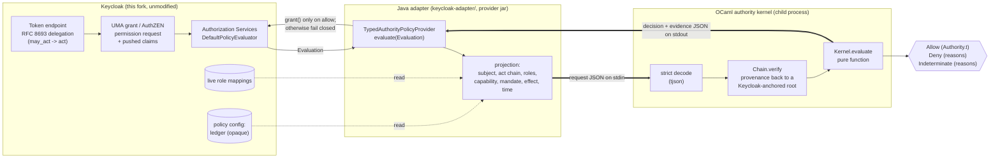

# Architecture

Keycloak remains the identity machine. It authenticates, issues and exchanges
tokens, records who may act for whom, and enforces the result. A policy
provider translates one Keycloak authorization question into a JSON document.
A small OCaml process answers it and says why.

## Integration points considered

| candidate | where in this fork | verdict |
|---|---|---|
| **Authorization Services `PolicyProvider` SPI** | `server-spi-private/.../authorization/policy/provider/PolicyProvider.java`: one method, `evaluate(Evaluation)` | **chosen** |
| AuthZEN evaluation endpoint | `authzen/services/.../AuthZenResource.java` | Not an interception point. It is a caller of the same policy evaluator, so the chosen provider is reachable through it with no extra code. Its subject is a PEP-asserted id resolved to a `UserModelIdentity`, with no token behind it, so a delegation chain would be an unverified assertion. The demo therefore uses the UMA grant, where the identity is the bearer token Keycloak itself verified. |
| Event listener SPI | `server-spi-private/.../events/EventListenerProvider.java` | Rejected. It runs after the fact and cannot deny. Useful for audit only. |
| Client policies (executors) | `server-spi-private/.../clientpolicy/executor/` | Rejected for resource decisions: executors gate OAuth protocol requests (token, exchange, registration), not "may X do Y to Z". A plausible place to gate delegation itself; see next steps. |
| `TokenExchangeProvider` SPI | `server-spi-private/.../protocol/oidc/TokenExchangeProvider.java` | Rejected for the MVP. It could attach a mandate at exchange time, but it shapes tokens rather than deciding on actions. |
| Patching `DefaultPolicyEvaluator` or `AuthorizationTokenService` | `server-spi-private`, `services` | Rejected. Invasive, and nothing it would enable is needed. |
| HTTP filters / Quarkus extensions | `quarkus/` | Rejected. Below the authorization model; resource and scope semantics would have to be rebuilt. |

## Why the policy provider

1. **Smallest seam that sees everything needed.** One `Evaluation` exposes:
   - the identity built from the verified bearer token, including the `act`
     claim. Keycloak writes `act` in its delegation exchange, but also for
     admin impersonation, and a protocol mapper can emit it too. The adapter
     therefore believes `act` only on tokens the token-exchange flow issued
     (`adversarial-review.md`).
   - the resource and scope being decided
   - the pushed claims (mandate, effect)
   - the policy's config (the ledger)
   - a `KeycloakSession` for reading live role mappings
2. **No upstream change.** The adapter is a provider jar dropped into
   `providers/`. `git diff 6688a3d6 -- ':!ocaml-authority' ':!README.md'` is
   empty.
3. **Keycloak's decision machinery stays in charge.** The OCaml policy is one
   policy inside Keycloak's normal permission and decision-strategy
   composition. It can be combined with, or compared against, conventional
   role policies. The demo realm runs both side by side.

## Who holds which authority

**Keycloak retains:**

- **Authentication**, token issuance and signing, and token lifetime. An
  expired or forged bearer token never reaches the kernel.
- **Delegation consent.** Samantha consents on Keycloak's consent screen, and
  FGAP v2 decides whether `research-agent` may act for users at all. Keycloak
  checks the `may_act` claim at exchange time and writes `act`. The kernel
  receives that chain, taken only from tokens the exchange issued. It never
  sees raw tokens.
- **The resource and scope registry.** A permission for an unknown resource
  or scope is rejected before any policy runs.
- **Composition and enforcement.** Which policies apply to which
  permissions, the decision strategy, and issuing an RPT (or a
  `{"result": true}`).
- **Role mappings.** These are the source of truth that root authority is
  anchored in. The kernel refers to roles but never assigns them.
- **Storage of the ledger.** Keycloak keeps it as an opaque string in the
  policy's config and never interprets it.

**The OCaml kernel decides:**

- Whether this acting principal, under this mandate, may invoke this
  capability on this resource to cause this effect. The inputs are:
  - Keycloak's verified facts
  - the ledger of grants, each with provenance
  - the evaluation time
- Why, in a decision document that answers the five questions and lists every
  check on every candidate grant.

**The kernel cannot:**

- Grant anything by itself. It can only cause `evaluation.grant()` to be
  called for a permission Keycloak was already evaluating.
- Widen what Keycloak allows. Other policies and the decision strategy still
  apply.
- Observe what actually happens after an ALLOW. See `threat-model.md` on
  effect honesty.

## The trust boundary

The boundary is a process boundary. The adapter writes one JSON document to
the kernel's stdin and reads one from its stdout, with a size cap and a
timeout.

Anything other than a well-formed `"decision": "allow"` is treated as a deny.
That includes:

- a non-zero exit
- a timeout
- oversize or unparseable output
- `deny`
- `indeterminate`

Both sides reject duplicate JSON keys. Jackson in strict duplicate-detection
mode handles the ledger on the Java side, and `tjson` handles the whole
request on the OCaml side. Without that, a parser differential could make the
two sides disagree about what a document says.

The kernel is a pure function of its input. It has no clock, no network and
no file access, so every decision can be replayed from its request document.
The test suite does exactly that.
